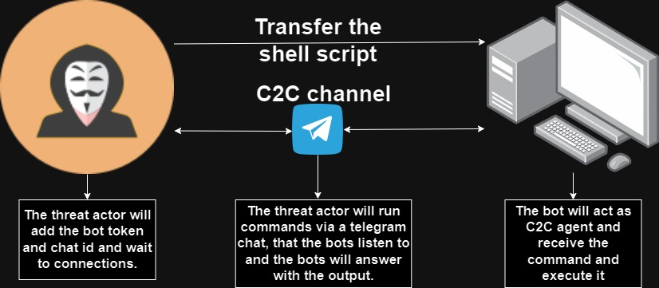
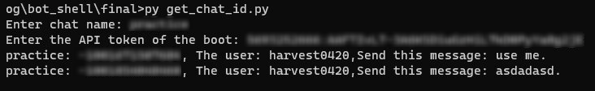
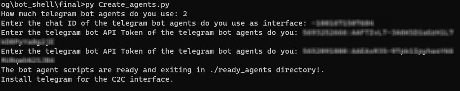
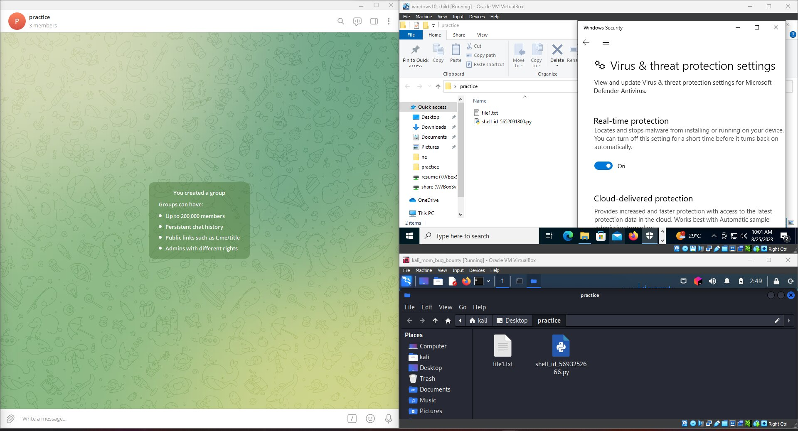
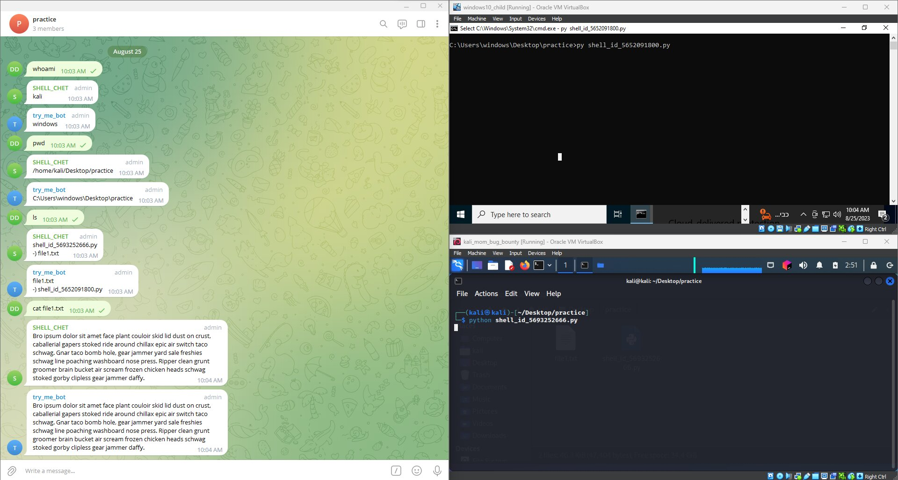

<h1 align="center">TelegramBot_C2C_Py</h1>
The TelegramBot C2C is a Python script that leverages the Telegram Bot API and the legitimate use of API to establish a covert command and control(C2C) communication channel with remote agents(telegram bots as the agents). This tool enables you to execute predefined Linux, Windows, and custom commands on target systems and receive their output directly through Telegram group or chat. The use of the Telegram API allows for seamless communication without requiring Telegram to be installed on the target systems. Due to the use of the chat as the C2C interface, it could run on the WAN without configuration (even in a VM network of NAT), and bypass the defender(the only AV check). The script will install all the requirements for its run process.


<h4>Demonstration Diagram:</h4>



<h2 align="center">Disclaimer</h2>
This tool is provided for educational purposes only. The authors are not responsible for any misuse or damage caused by this tool. Use at your own risk.

<h2 align="center">Features</h2>

- Command execution on remote target systems through Telegram.
- Secure communication using Telegram's API.
- Cross-platform support for Linux and Windows targets.
- Predefined commands for common OS and the ability to run custom commands of the C2C.
- Send a command to a spefic bot using: !![bot user-name] [command]
- Help command that print the C2C command and the OS commands based on the OS it work at.

<h2 align="center">Prerequisites</h2>

<h4>Threat actor side:</h4>

- python 3.x:
  - [requests library](https://requests.readthedocs.io/en/latest/) (Install using pip install requests)
 
- Script Needs:
  - Install telegram and connect to the telegram account.
  - Create bots for the agents and main chat group.
  - Save the bot API and username.
  - Get the chat id.
  - Insert the bots with minimal administration privilege in the group chat.
  - Insert the chat id and the bot API to the shell.py file(create_agents.py can preform that) .

<h4>Tagret side</h4>

- Python 3.x:

  - [telepot library](https://telepot.readthedocs.io/en/latest/#send-a-message) (Install using pip install telepot)
  - [urllib3 1.24.1 library](https://urllib3.readthedocs.io/en/stable/) (Install using pip3 install urllib3==1.24.1)

<h2>Usage</h2>

<h4>Threat actor side:</h4>

- Clone this repository to your local machine:

```
  git clone https://github.com/D0rDa4aN919/TelegramBot_C2C_Py.git
  cd telegrambot-reverse-shell
```

- Create a Telegram bot and get your bot token:
  - Follow the official Telegram guide to create a new bot and obtain its token(using the Botfother).
  
- Get the chat ID of the group you want to work with those three methods:
  - Exectue the get_chat_id.py file and enter the bot API token and the chat name.
  - Get the chat id from the API getUpdate url: https://api.telegram.org/bot[bot API token]/getUpdates.
  - You can use tools like @userinfobot to get the chat ID of your group.


    
- Edit the shell.py file:
  - Execute the create_agents.py and insert the amount of bots you want to use and there APIs to insert them and create new file in the ready_agents directory.



- Transfer the new agents scripts to the targets machines.



<h4>Target side:</h4>

- Wait to the target execute the agent side script(using soical social engineering).

- Interact with the agent:
In the Telegram group, send commands prefixed with linux, windows, or custom to execute predefined Linux, Windows, or custom commands. The agent will execute the command and reply with the output.



<h2 align="center">Security Considerations</h2>

- Use responsibly: This tool is intended for educational and ethical purposes. Do not use it for malicious intent.
- Risk of exposure: While the Telegram API offers encryption, there is always a risk of exposure. Avoid sending sensitive information through the tool.
- Legality: Ensure that you comply with local laws and regulations before using this tool.

<h2 align="center">License</h2>

This project is licensed under the MIT License - see the [LICENSE](LICENSE) file for details.

<h2 align="center">Author</h2>

- [D0rDa4aN919](https://github.com/D0rDa4aN919)

<h2 align="center">Acknowledgments</h2>
The tool was developed to demonstrate how to produce and disseminate C2C telegram in a controlled setting. It is not meant to support or facilitate any nefarious or unlawful activity..

<h2 align="center">reference</h2>

- [C2C](https://medium.com/@dordaha491n/understanding-command-and-control-c2c-57cdc78a5216))
- [C2C Telegram Chat Bot](https://medium.com/@dordaha491n/covert-communication-via-telegram-chat-a-c2c-bot-interface-924effbc659e)

- [Telegram API Documentation](https://core.telegram.org/)

- [Commmand and Control]()
